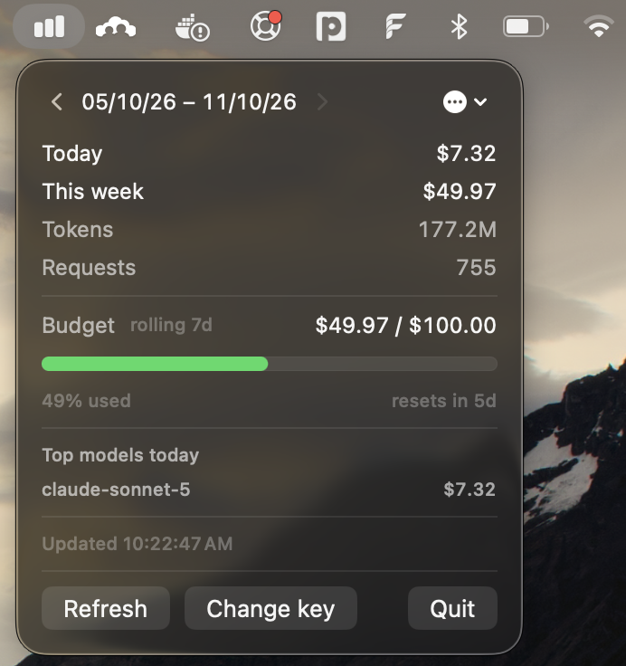
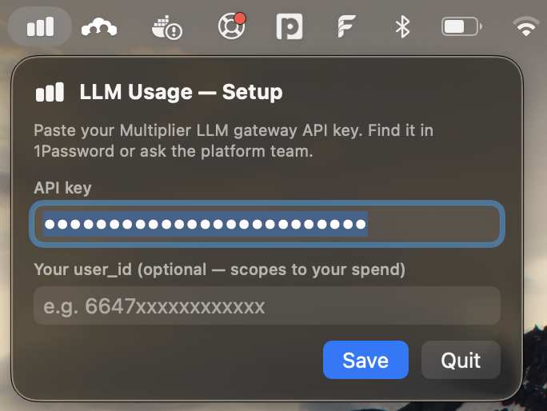

# LLM Usage — Menu Bar + Desktop Widget

Menu bar widget for LiteLLM-compatible LLM gateways. Configurable URL, no defaults.

## Install

```bash
git clone https://github.com/madhupmamodia/llm-usage.git
cd llm-usage
./bin/bundle.sh --install
```

The script checks for Swift + codesign + accepted Xcode license and prints a fix command if anything is missing. Fresh Mac? Run `xcode-select --install` and `sudo xcodebuild -license accept` first.

Builds locally + installs to `/Applications` + launches. No download, no Gatekeeper prompt (locally-built apps aren't quarantined, and the bundle script strips any inherited xattrs).

To update later: `git pull && ./bin/bundle.sh --install`.
To uninstall: `./bin/bundle.sh --uninstall`.

## Update

App version is shown in the menu bar: click the chart icon, the title bar shows `LLM Usage`.

### From a git clone (recommended)

```bash
cd ~/path/to/llm-usage
git pull
./bin/bundle.sh --install
```

The script kills the running instance, rebuilds, copies to `/Applications`, and relaunches. Config in `~/.llm-usage-*` is preserved.

### From a pre-built release

```bash
# Download LLMUsage.zip from https://github.com/madhupmamodia/llm-usage/releases
# Then:
rm -rf /Applications/LLMUsage.app
unzip -o ~/Downloads/LLMUsage.zip -d /Applications/
open /Applications/LLMUsage.app
```

First launch after replacing the bundle: right-click → Open → "Open" to clear Gatekeeper (one-time per machine).

### Check your version

```bash
defaults read /Applications/LLMUsage.app/Contents/Info CFBundleShortVersionString
```

CI auto-cuts a new version on every push to `main`. The `Latest` release is always the most recent.

## Releases (alternative)

→ https://github.com/madhupmamodia/llm-usage/releases

Pre-built `LLMUsage.zip` available if you don't want to clone+build. **Ad-hoc signed** (no Apple Dev account) — on first launch macOS shows Gatekeeper. Workaround: right-click `LLMUsage.app` → Open → "Open" in dialog. Once done, app is trusted forever.

Every push to `main` auto-cuts a new version (`v1.0.0` → `v1.0.1` → …). To bump minor/major manually:
```bash
git tag v1.1.0 && git push --tags
```

## Screenshots





## Configure

On first launch, the setup screen asks for:
- **API key** — your gateway API key
- **Gateway URL** — full URL to your LiteLLM instance (e.g. `https://llm-gateway.example.com`)
- **user_id** — optional, scopes spend to your account only

Saved to mode 600 files in `$HOME`:
```bash
~/.llm-usage-key       # API key
~/.llm-usage-config    # Gateway URL
~/.llm-usage-user      # user_id (optional)
```

### Auto-detect from `~/.zshrc`

If `~/.llm-usage-key` is missing, the app parses `~/.zshrc` for `LITELLM_API_KEY="..."` and pre-fills the setup screen (badged "detected from ~/.zshrc"). Edit, replace, or save as-is — your choice.

## Auto-start at login

`System Settings → General → Login Items → Open at Login → + → ~/workspace/llm-usage/LLMUsage.app`

## Desktop widget (later)

The `Widget/` directory is the Swift source + Info.plist + entitlements for a real `WidgetKit` widget. To build it:

1. Install full Xcode (`xcode-select --install` won't work — App Store → Xcode).
2. Open Xcode → File → New → Project → macOS → App (SwiftUI). Name it `LLMUsage`.
3. File → New → Target → Widget Extension → name `LLMUsageWidget`, uncheck "Include Configuration Intent".
4. In the new target, replace its generated `.swift` and `Info.plist` with the files in `Widget/`.
5. Signing & Capabilities → select your team.
6. Build & run the app once (so the widget is registered), then right-click desktop → "Add Widget" → search `LLM Usage`.

The widget reads the same `~/.llm-usage-*` files as the menu bar app.

## Files

- `Package.swift` — SPM manifest for the menu bar app.
- `Sources/llm-usage/` — Swift sources (Models, UsageStore, App).
- `bin/bundle.sh` — rebuild script (`./bin/bundle.sh` to refresh `LLMUsage.app`).
- `Resources/Info.plist` — bundle metadata.
- `LLMUsage.app/` — built bundle. `open LLMUsage.app` to run.
- `Widget/` — Xcode widget extension sources for later.
- `.github/workflows/build.yml` — CI: build + auto-bump version + release on every push.